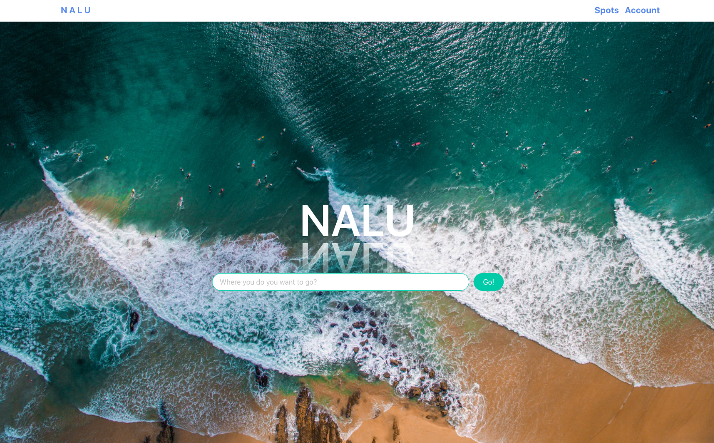
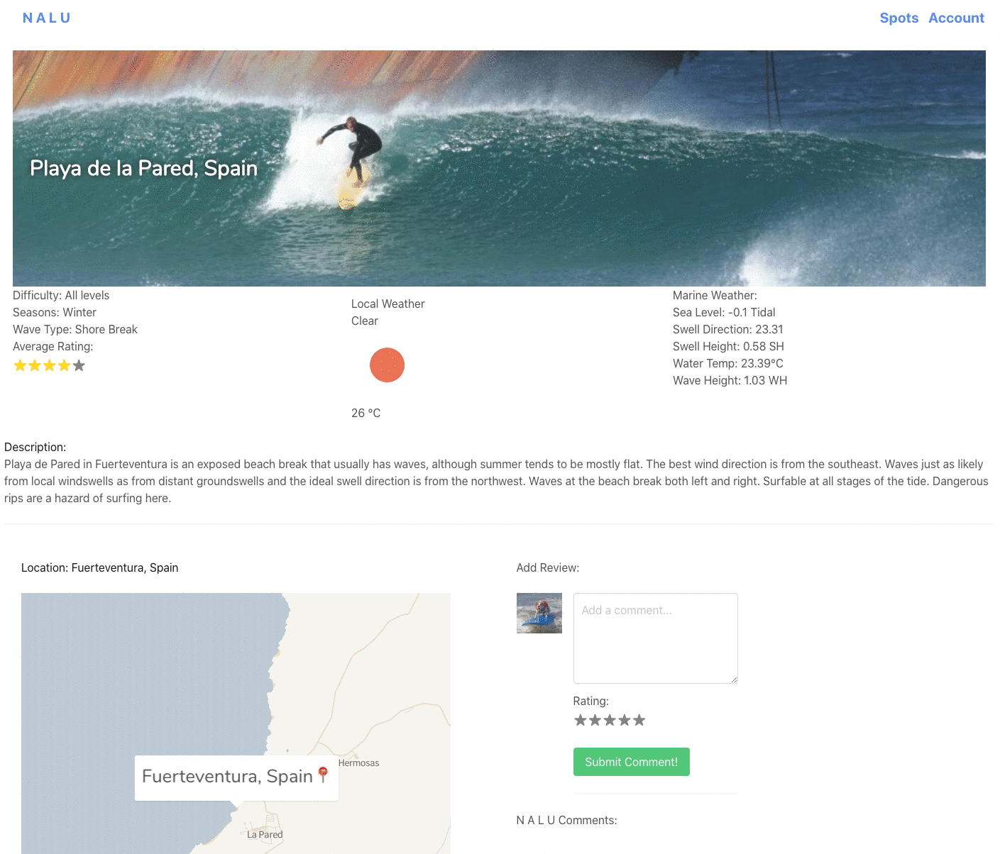
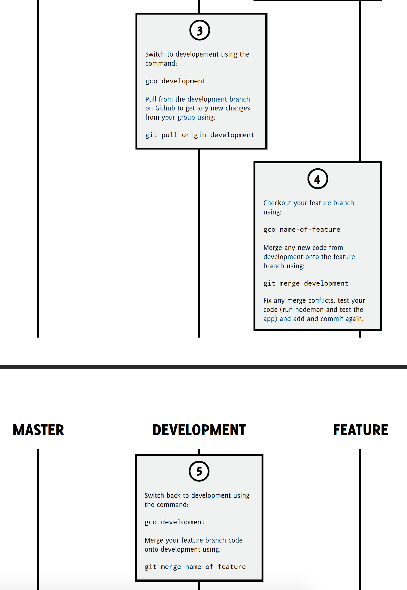
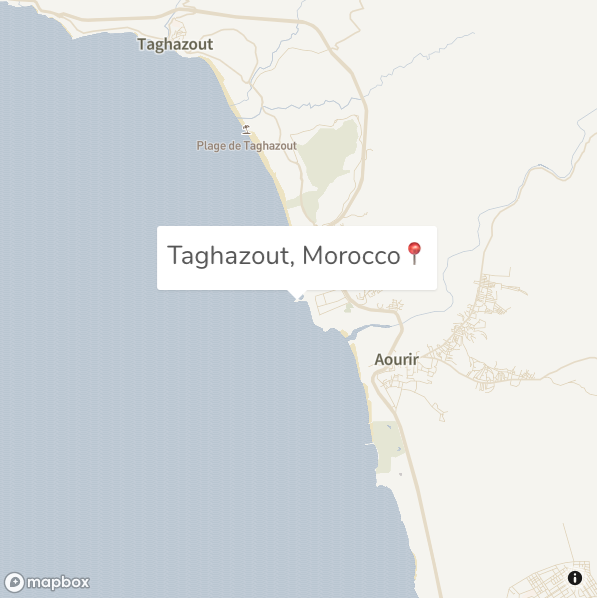
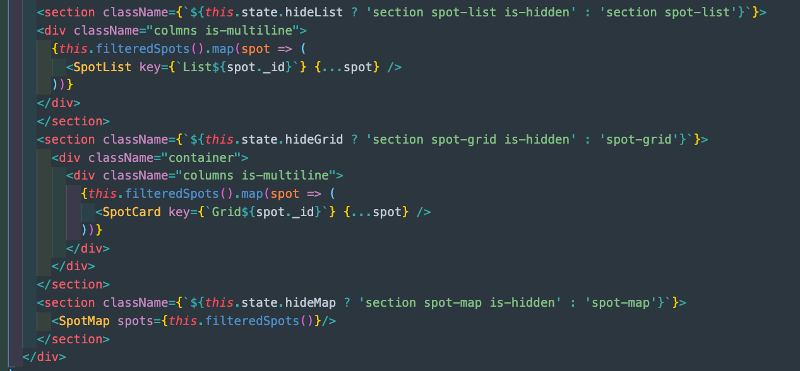
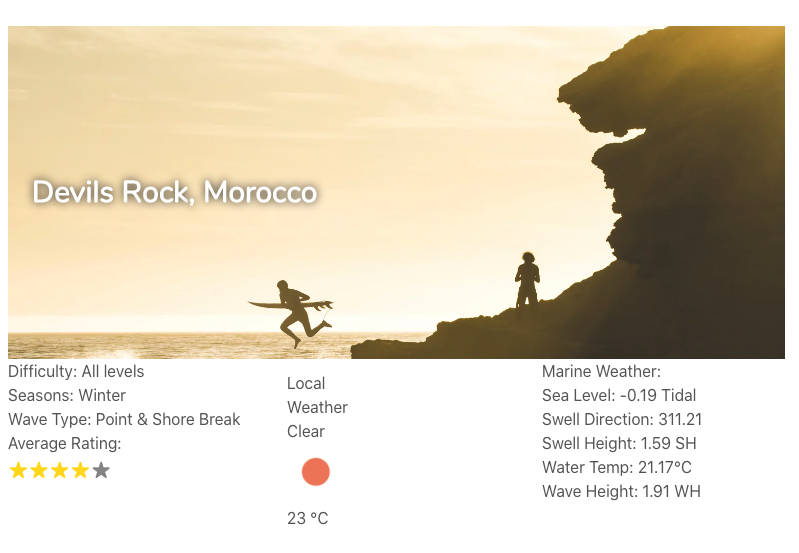

# General Assembly SEI-49 | Project 3 - NALU :ocean:

​

Home Page

Example of adding comments

## :rocket: Overview

Our product **aims to give users all current information related to the best surfing spots around the world.** The user will have the **ability to search** any surfing spots by location which will display all detailed cards.

The user will have their **own profile where they can add** certain locations where they have surfed. Users can also **comment and rate on each surfspot** on the website as well as **add a location**.

**This project raised the difficulties to work in a group which immediately allowed us to understand what were the market minimum requirements.** We decided to allocate a **meticulous time to prepare** the redistribution of tasks between the client and backend. One of the early difficulty was to **understand how to work with the git branches** in order to prevent conflicting with one and each others work.

---

The App is hosted here  
Else, kindly clone or fork the repository:  
To install all the packages listed in the package.json: —> npm i  
Check the console for any issues and if there are any then check the package.json for any dependancies missing —>  
Open the frontend code frontend in your terminal  
Type npm i in your terminal to dl dependencies then npm start  
Navigate to [http://localhost:3000/](http://localhost:3000/)

## :surfer: Contributers

- [Julien Xemard](https://github.com/JulienXemard)
- [Bec Sun](https://github.com/becsun)
- [Brenda Ty](https://github.com/brendino500)
- [Dan Price](https://github.com/Zarathustrah)

## :hourglass_flowing_sand: Timeframe

7 days

## Technologies Used

- HTML5
- SCSS & Bulma
- ReactJS
- JavaScript (ES6)
- MongoDB & Mongoose
- Bcrypt & JWT
- Git Unix
- Insomnia
- Trello Board

---

## :desktop_computer: Technical Requirements

- **Build a full-stack application** by making your own backend and your own front-end
- **Use an Express API** to serve your data from a Mongo database
- **Consume your API with a separate front-end** built with React
- **Be a complete product** which most likely means multiple relationships and CRUD functionality for at least a couple of models
- **Implement thoughtful user stories/wireframes** that are significant enough to help you know which features are core MVP and which you can cut
- **Have a visually impressive design** to kick your portfolio up a notch and have something to wow future clients & employers. **ALLOW** time for this.
- **Be deployed online** so it's publicly accessible.

Example of adding a new surf spot

---

## :chart_with_upwards_trend: Process

- As a group we set up our machines and wrote a **table of a basic timeline** with jobs allocated to certain people. We wanted to make it broad and write down the **main functionalities we wanted to complete by certain dates**.

- After that, still in a group, we **sourced information to create our API** on specific surf locations. Once we had this information, we could then create our backend and this would be our **seeds data**.

- Once this was completed Julien and Brenda coded the backend, whilst Dan created the basic React pages and Bec was in charge of styling the whole project as well as form validation.

- Julien and Brenda completed the backend by **testing on Insomnia**. This was very useful to visualise what the code was doing and **particulary debugging**.

- Bec did an **incredible job of styling the whole project**, which was a lot of **pressure on her, something of which she took for the whole team**. Bec styled the project all on Bulma and the challenges were to create the styling which wouldn't be overridden by Bulma.

- As well as stlying, Bec also supported Dan with form validation.

- Once the backend was complete, Julien and Brenda pair coded frontend functionalites for example: the list/grid/map view of the surf spots, calling the weather APIs, creating the map and a smaller map for the individual surf spot and functionality to add an achieved surf spot to the users profile.

## :mag: Features

- We were really excited to **implement MapBox** within our project as it was the perfect fit with our idea.
- Therefore, we decided to **reverse engineer and factorise an idea** we came across during our researches:
- The use of **conditional rendering** into MapBox to display our images under the form of cards if the user clicks onto the geolocated markers.

 
Example of MapBox

Example of ternary conditional rendering

---

## :trophy: Wins

- Along with our own MongoDB we also called **another 2 APIs: one for the weather & one for the tidal conditions.**
- The challenge was to create a function that would allow us to **implement the latitude & longitude** available from our Seed file inside the API URL.
- If extracting information from an API targeting one geolocation wasn’t too difficult, doing it for locations all over the world was a major headache but an **incredible learning curve.**

## :tada: Sources

[Storm Glass](https://stormglass.io/)
 

[Open Weather API](https://openweathermap.org/api)
 

[MapBox](https://www.mapbox.com/)
 

[Hikr](https://hikrr.herokuapp.com/)
